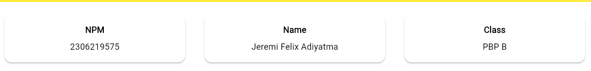
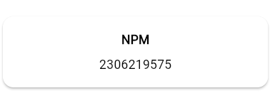

## Toko Musik John Lennon
nama : Jeremi Felix Adiyatma
NPM : 2306219575
Kelas : PBP B

# Tugas 7

# Penjelasan Kode

1. Membuat main.dart untuk base dari app yang akan dibuat. Terdapat fungsi main() untuk menjalankan widget-widget yang sudah dibuat. Serta menentukan colorScheme dari app.

```dart
import 'package:flutter/material.dart';
import 'package:toko_musik_john_lennon/menu.dart';

void main() {
  runApp(const MyApp());
}

class MyApp extends StatelessWidget {
  const MyApp({super.key});

  // This widget is the root of your application.
  @override
  Widget build(BuildContext context) {
    return MaterialApp(
      title: 'Flutter Demo',
      theme: ThemeData(
        colorScheme: ColorScheme.fromSwatch(primarySwatch:Colors.yellow,
        ).copyWith(secondary: Colors.yellow[400]) ,   
        useMaterial3: true,
      ),
      home: MyHomePage(),
    );
  }
}

```
2. Membuat beberapa variabel final, constructor, dan list warna untuk memberikan warna yang berbeda di tiap button

```dart
final String npm = '2306219575'; // NPM
  final String name = 'Jeremi Felix Adiyatma'; // Nama
  final String className = 'PBP B'; // Kelas
  final List<ItemHomepage> items = [
    ItemHomepage("Lihat Daftar Produk", Icons.mood, Colors.red),
    ItemHomepage("Tambah Produk", Icons.add, Colors.blue),
    ItemHomepage("Logout", Icons.logout, Colors.green),
  ];
  MyHomePage({super.key});
```
3.Membuat class ItemHomepage yang memiliki atribut nama dan icon, dan color

```dart
final String name;
  final IconData icon;
  final Color color;

  ItemHomepage(this.name, this.icon,this.color);
```
4. Membuat class ItemCard untuk menampung class-class ItemHomePage untuk menampung dan styling item name, icon, dan terdapat fungsi onTap() untuk menampilkan snackbar dengan fungsi built-in.
```dart
class ItemCard extends StatelessWidget {
  // Menampilkan kartu dengan ikon dan nama.

  final ItemHomepage item;

  const ItemCard(this.item, {super.key});

  @override
  Widget build(BuildContext context) {
    return Material(
      // Menentukan warna latar belakang dari tema aplikasi.
      color: item.color,
      // Membuat sudut kartu melengkung.
      borderRadius: BorderRadius.circular(12),

      child: InkWell(
        // Aksi ketika kartu ditekan.
        onTap: () {
          // Menampilkan pesan SnackBar saat kartu ditekan.
          ScaffoldMessenger.of(context)
            ..hideCurrentSnackBar()
            ..showSnackBar(SnackBar(
                content: Text("Kamu telah menekan tombol ${item.name}!")));
        },
        // Container untuk menyimpan Icon dan Text
        child: Container(
          padding: const EdgeInsets.all(8),
          child: Center(
            child: Column(
              // Menyusun ikon dan teks di tengah kartu.
              mainAxisAlignment: MainAxisAlignment.center,
              children: [
                Icon(
                  item.icon,
                  color: Colors.white,
                  size: 30.0,
                ),
                const Padding(padding: EdgeInsets.all(3)),
                Text(
                  item.name,
                  textAlign: TextAlign.center,
                  style: const TextStyle(color: Colors.white),
                ),
              ],
            ),
          ),
        ),
      ),
    );
  }
}

```
5. Membuat fungsi wajib pada widget utama. Membaut 1 row untuk menampilkan npm, nama, dan kelas. Dan juga membuat GridView untuk menampilkan ItemCard dan membuat item builder yang sifatnya seperti looping untuk menampilkan masing-masing button sesuai dengan list warna yang sudah dibuat.

```dart
@override
  Widget build(BuildContext context) {
    // Scaffold menyediakan struktur dasar halaman dengan AppBar dan body.
    return Scaffold(
      // AppBar adalah bagian atas halaman yang menampilkan judul.
      appBar: AppBar(
        // Judul aplikasi "Mental Health Tracker" dengan teks putih dan tebal.
        title: const Text(
          'Toko Musik John lennon',
          style: TextStyle(
            color: Colors.white,
            fontWeight: FontWeight.bold,
          ),
        ),
        // Warna latar belakang AppBar diambil dari skema warna tema aplikasi.
        backgroundColor: Theme.of(context).colorScheme.primary,
      ),
      // Body halaman dengan padding di sekelilingnya.
      body: Padding(
        padding: const EdgeInsets.all(16.0),
        // Menyusun widget secara vertikal dalam sebuah kolom.
        child: Column(
          crossAxisAlignment: CrossAxisAlignment.center,
          children: [
            // Row untuk menampilkan 3 InfoCard secara horizontal.
            Row(
              mainAxisAlignment: MainAxisAlignment.spaceEvenly,
              children: [
                InfoCard(title: 'NPM', content: npm),
                InfoCard(title: 'Name', content: name),
                InfoCard(title: 'Class', content: className),
              ],
            ),

            // Memberikan jarak vertikal 16 unit.
            const SizedBox(height: 16.0),

            // Menempatkan widget berikutnya di tengah halaman.
            Center(
              child: Column(
                // Menyusun teks dan grid item secara vertikal.

                children: [
                  // Menampilkan teks sambutan dengan gaya tebal dan ukuran 18.
                  const Padding(
                    padding: EdgeInsets.only(top: 16.0),
                    child: Text(
                      'Welcome to Toko Musik John Lennon',
                      style: TextStyle(
                        fontWeight: FontWeight.bold,
                        fontSize: 18.0,
                      ),
                    ),
                  ),

                  // Grid untuk menampilkan ItemCard dalam bentuk grid 3 kolom.
                  GridView.count(
                    primary: true,
                    padding: const EdgeInsets.all(20),
                    crossAxisSpacing: 10,
                    mainAxisSpacing: 10,
                    crossAxisCount: 3,
                    // Agar grid menyesuaikan tinggi kontennya.
                    shrinkWrap: true,

                    // Menampilkan ItemCard untuk setiap item dalam list items.
                    children: items.map((ItemHomepage item) {
                      return ItemCard(item);
                    }).toList(),
                  ),
                ],
              ),
            ),
          ],
        ),
      ),
    );
  }

```

# Pertanyaan
1. Jelaskan apa yang dimaksud dengan stateless widget dan stateful widget, dan jelaskan perbedaan dari keduanya.

    Stateless widget adalah widget yang tidak mengalami perubahan selama siklus hidupnya. Ini berarti widget ini tidak menyimpan informasi keadaan atau "state", sehingga hanya menampilkan tampilan sesuai data yang diberikan pada saat pertama kali dibuat, tanpa kemampuan beradaptasi berdasarkan interaksi atau perubahan data lebih lanjut. Tipe widget ini cocok untuk komponen statis yang tidak perlu memperbarui tampilan seiring waktu, seperti Text, Icon, dan elemen dekoratif lain yang tidak berubah meskipun ada aksi dari pengguna.

    Sebaliknya, stateful widget memiliki state atau keadaan yang bisa berubah selama interaksi dengan pengguna atau ketika data internal diperbarui. Mereka dapat memperbarui tampilan mereka setiap kali state-nya berubah, sehingga ideal untuk elemen-elemen yang perlu beradaptasi secara dinamis. Contohnya adalah formulir yang responsif terhadap input pengguna, slider interaktif, atau animasi yang perlu terus diperbarui. Setiap kali ada perubahan pada state, framework akan menggambar ulang widget tersebut sesuai data terbaru atau tindakan pengguna.

2. Sebutkan widget apa saja yang kamu gunakan pada proyek ini dan jelaskan fungsinya.


    1. MaterialApp Berfungsi sebagai root aplikasi Flutter dan mengatur tema, nama aplikasi, serta konfigurasi awal. Ini mengatur navigasi dan tampilan keseluruhan aplikasi.
    2. Scaffold Menyediakan struktur dasar layar, seperti AppBar, Body, dan Bottom Navigation. Di sini digunakan untuk membangun tampilan utama aplikasi.
    3. Text Menampilkan teks statis atau dinamis sesuai dengan data yang diberikan.
    4. Padding Menambahkan ruang di sekitar widget agar tampilan lebih rapi.
    5. Column Mengatur tata letak widget secara vertikal
    6. Row Mengatur tata letak secara horizontal
    7. Card Menyediakan tampilan berupa kartu dengan elevation
    8. GridView.builder Membuat tata letak berbentuk grid secara dinamis berdasarkan data yang ada.
    9. ItemCard widget kustom yang menampilkan setiap item dalam grid dengan warna latar belakang tertentu dan ikon yang sesuai.
    10. InkWell Memberikan efek ripple saat widget diketuk
    11. MediaQuery Mendapatkan informasi ukuran layar, seperti lebar perangkat agar card lebih responsive terhadap layar
    12. SnackBar Menampilkan notifikasi sementara di bagian bawah layar saat pengguna mengetuk item tertentu
    13. AppBar Header bagian atas halaman yang berisi judul aplikasi.
    14. SizedBox Memberikan jarak kosong atau memanipulasi ukuran widget.
    15. GridView.count Menampilkan widget dalam bentuk grid dengan jumlah kolom tetap.
    16. Container Widget fleksibel untuk menyimpan elemen dan mengatur ukuran, padding, serta warna latar belakang.
    17. Material Menambahkan visual material pada widget.
    18. InfoCard (Widget/Component buatan) Widget kartu khusus untuk menampilkan informasi NPM, nama, dan kelas.
    19. Center Memposisikan widget anaknya di tengah.

3. Apa fungsi dari setState()? Jelaskan variabel apa saja yang dapat terdampak dengan fungsi tersebut.
    Fungsi setState() pada Flutter memberi tahu framework bahwa ada perubahan pada state widget tertentu, sehingga framework akan menggambar ulang komponen yang terpengaruh. Fungsi ini hanya dapat digunakan pada stateful widget, karena stateless widget tidak mendukung perubahan dinamis. Misalnya, jika widget membutuhkan pembaruan elemen seperti detail pengguna yang diinput, seperti nama, npm, atau kelas, setState() tidak diperlukan jika elemen-elemen tersebut dideklarasikan sebagai final, karena variabel final hanya diinisialisasi sekali dan tidak berubah sepanjang waktu.

4. Jelaskan perbedaan antara const dengan final.
    Kata kunci final digunakan untuk mendeklarasikan variabel yang hanya dapat diinisialisasi satu kali tetapi nilainya bisa ditentukan saat runtime. Sedangkan const digunakan untuk nilai yang harus ditetapkan pada saat kompilasi, sehingga sifatnya tidak dapat diubah atau "immutable". Setelah ditetapkan, baik variabel final maupun const tidak dapat diubah. Meskipun setiap const otomatis bersifat final, namun tidak semua final memenuhi syarat untuk menjadi konstanta.


# Tugas 8

1. Apa kegunaan const di Flutter? Jelaskan apa keuntungan ketika menggunakan const pada kode Flutter. Kapan sebaiknya kita menggunakan const, dan  
   kapan sebaiknya tidak digunakan?
    Penggunaan const di Flutter sangat penting untuk efisiensi performa dan pengelolaan memori. Ketika kita menggunakan const, objek yang dibuat menjadi immutable, artinya objek tersebut tidak bisa diubah setelah dibuat, sehingga sering dipakai untuk widget atau elemen UI yang bersifat statis. Keuntungannya, objek const hanya diciptakan sekali di memori dan bisa digunakan berulang tanpa perlu membuat salinan baru. Ini tentu menghemat penggunaan memori dan mempercepat rendering UI karena widget yang diberi label const tidak perlu dibangun ulang setiap kali tampilan diperbarui. Di sisi lain, karena const dapat diketahui lebih awal oleh Flutter, proses kompilasi pun bisa lebih optimal, menjadikan aplikasi lebih efisien.

    Namun, const sebaiknya hanya digunakan pada elemen-elemen yang sifatnya tidak berubah, seperti teks, ikon, atau pengaturan tetap (misalnya warna dan ukuran). Di sisi lain, const kurang tepat jika digunakan pada objek yang bergantung pada input dinamis pengguna atau kondisi aplikasi. Contohnya, data yang diambil dari API atau variabel yang bisa berubah-ubah tergantung interaksi pengguna tidak bisa diberi label const.

2. Jelaskan dan bandingkan penggunaan Column dan Row pada Flutter. Berikan contoh implementasi dari masing-masing layout widget ini!
    Column adalah widget yang menyusun elemen-elemen anaknya secara vertikal, dari atas ke bawah. Gunakan Column jika kamu ingin menata beberapa elemen secara bertingkat ke bawah. Sebaliknya, Row menyusun elemen-elemen anaknya secara horizontal, dari kiri ke kanan. Row cocok dipakai saat kamu ingin elemen-elemen tampil sejajar dalam satu baris. Kedua widget ini sangat berguna untuk mengatur tata letak elemen-elemen di layar sesuai dengan kebutuhan desain.
    contoh implementasi row:
    ```dart
    Row(
          mainAxisAlignment: MainAxisAlignment.spaceEvenly,
          children: [
            InfoCard(title: 'NPM', content: npm),
            InfoCard(title: 'Name', content: name),
            InfoCard(title: 'Class', content: className),
          ],
        ),
    ```
    hasil implementasi row:
    
    contoh implementasi column:
    ```dart
    Column(
      children: [
        Text(
          title,
          style: const TextStyle(fontWeight: FontWeight.bold),
        ),
        const SizedBox(height: 8.0),
        Text(content),
      ],
    ),
    ```
    hasil implementasi row:
        
3. Sebutkan apa saja elemen input yang kamu gunakan pada halaman form yang kamu buat pada tugas kali ini. Apakah terdapat elemen input Flutter lain 
   yang tidak kamu gunakan pada tugas ini? Jelaskan!
   Pada form yang saya buat, ada tiga elemen input utama:

    -Item: Menggunakan TextFormField untuk input teks yang mewakili nama produk
    -Picture link: Menggunakan TextFormField untuk input teks yang mewakili foto produk yang diambil dari link
    -harga: Menggunakan TextFormField  dengan validasi agar hanya angka yang diterima.
    -Description: Menggunakan TextFormField untuk deskripsi produk
     Ada beberapa elemen input lain yang seharusnya bisa digunakan namun tidak saya pilih untuk tugas ini, seperti:

    1. Checkbox: Untuk memilih opsi atau persetujuan.
    2. Radio: Untuk pilihan tunggal dalam satu grup.
    3. Switch: Untuk mengaktifkan atau menonaktifkan pengaturan.
    4. DropdownButton: Untuk memilih dari daftar pilihan.
    5. Slider: Untuk memilih nilai dalam rentang tertentu.
    6. DatePicker: Untuk memilih tanggal.


4. Bagaimana cara kamu mengatur tema (theme) dalam aplikasi Flutter agar aplikasi yang dibuat konsisten? Apakah kamu mengimplementasikan tema pada 
   aplikasi yang kamu buat?
    Ya, saya telah mengimplementasikan tema di aplikasi yang saya buat. Tema diatur menggunakan ThemeData dalam properti theme pada MaterialApp di file main.dart. Warna utama dan sekunder diatur melalui ColorScheme. Misalnya, saya menetapkan primarySwatch ke Colors.yellow dan warna sekunder ke warna kuning yang lebih terang untuk menciptakan konsistensi visual di seluruh aplikasi.

5. Bagaimana cara kamu menangani navigasi dalam aplikasi dengan banyak halaman pada Flutter?
    Dalam aplikasi ini, saya menggunakan metode Navigator.push dan Navigator.pop untuk navigasi antar halaman. Navigator.push menambahkan halaman baru ke dalam stack navigasi, sehingga halaman tersebut menjadi halaman aktif di atas halaman sebelumnya. Pengguna masih bisa kembali ke halaman sebelumnya menggunakan Navigator.pop, yang menghapus halaman aktif dari stack dan membawa pengguna kembali ke halaman sebelumnya. Untuk mempermudah navigasi, saya juga menambahkan sebuah drawer di aplikasi.


# Tugas 9

# Penjelasan Kode
1. Register
    1. Input Data Akun: Pengguna memasukkan data akun seperti username dan password melalui form register di aplikasi Flutter.
    2. Pengiriman Data ke Server: Data yang dimasukkan dikirim ke server Django menggunakan permintaan HTTP POST. Contoh pengiriman data:
    ```dart
    final response = await request.postJson(
                        "http://127.0.0.1:8000/auth/register/",
                        jsonEncode({
                        "username": username,
                        "password1": password1,
                        "password2": password2,
                        }));
    ```
    3. Pemrosesan di Server: Server Django memproses data yang diterima, memvalidasi, dan menyimpan data akun baru ke database. Jika berhasil, server mengirimkan respons sukses.
    4. Tampilan di Flutter: Aplikasi Flutter menerima respons dari server dan menampilkan pesan sukses atau gagal. Jika sukses, pengguna diarahkan ke halaman login.
2. Login
    1. Input Data Akun: Pengguna memasukkan username dan password melalui form login di aplikasi Flutter.
    2. Pengiriman Data ke Server: Data login dikirim ke server Django menggunakan permintaan HTTP POST. Contoh pengiriman data:
    ```dart
  
    final response = await request
        .login("http://127.0.0.1:8000/auth/login/", {
    'username': username,
    'password': password,
    });
    ```
    3. Pemrosesan di Server: Server Django memverifikasi kredensial yang diterima. Jika valid, server mengirimkan cookie sesi yang menandakan bahwa pengguna telah berhasil login.
    4. Tampilan di Flutter: Aplikasi Flutter menerima cookie sesi dan menyimpannya. Pengguna diarahkan ke halaman utama (menu) dan pesan selamat datang ditampilkan.
3. Logout
    1. Permintaan Logout: Pengguna menekan tombol logout di aplikasi Flutter.
    2. Pengiriman Permintaan ke Server: Aplikasi Flutter mengirim permintaan logout ke server Django menggunakan permintaan HTTP POST. Contoh pengiriman data:
    ```dart
    final response = await request.logout(
            "http://127.0.0.1:8000/auth/logout/");
    ```
4. Implementasi Checklist
    1. Selanjutnya, saya membuat sebuah file baru bernama register.dart di direktori toko_musik_john_lennon/lib/screens untuk halaman registrasi akun.
    2. Pada file register.dart, saya membuat halaman registrasi dengan form untuk username, password, dan konfirmasi password, serta tombol untuk mengirim data ke server Django.
```dart
import 'dart:convert';
import 'package:flutter/material.dart';
import 'package:toko_musik_john_lennon/screens/login.dart';
import 'package:pbp_django_auth/pbp_django_auth.dart';
import 'package:provider/provider.dart';

class RegisterPage extends StatefulWidget {
  const RegisterPage({super.key});

  @override
  State<RegisterPage> createState() => _RegisterPageState();
}

class _RegisterPageState extends State<RegisterPage> {
  final _usernameController = TextEditingController();
  final _passwordController = TextEditingController();
  final _confirmPasswordController = TextEditingController();

  @override
  Widget build(BuildContext context) {
    final request = context.watch<CookieRequest>();
    return Scaffold(
      appBar: AppBar(
        title: const Text('Register'),
        leading: IconButton(
          icon: const Icon(Icons.arrow_back),
          onPressed: () {
            Navigator.pop(context);
          },
        ),
      ),
      body: Center(
        child: SingleChildScrollView(
          padding: const EdgeInsets.all(16.0),
          child: Card(
            elevation: 8,
            shape: RoundedRectangleBorder(
              borderRadius: BorderRadius.circular(12.0),
            ),
            child: Padding(
              padding: const EdgeInsets.all(20.0),
              child: Column(
                mainAxisSize: MainAxisSize.min,
                children: <Widget>[
                  const Text(
                    'Register',
                    style: TextStyle(
                      fontSize: 24.0,
                      fontWeight: FontWeight.bold,
                    ),
                  ),
                  const SizedBox(height: 30.0),
                  TextFormField(
                    controller: _usernameController,
                    decoration: const InputDecoration(
                      labelText: 'Username',
                      hintText: 'Enter your username',
                      border: OutlineInputBorder(
                        borderRadius: BorderRadius.all(Radius.circular(12.0)),
                      ),
                      contentPadding:
                          EdgeInsets.symmetric(horizontal: 12.0, vertical: 8.0),
                    ),
                    validator: (value) {
                      if (value == null || value.isEmpty) {
                        return 'Please enter your username';
                      }
                      return null;
                    },
                  ),
                  const SizedBox(height: 12.0),
                  TextFormField(
                    controller: _passwordController,
                    decoration: const InputDecoration(
                      labelText: 'Password',
                      hintText: 'Enter your password',
                      border: OutlineInputBorder(
                        borderRadius: BorderRadius.all(Radius.circular(12.0)),
                      ),
                      contentPadding:
                          EdgeInsets.symmetric(horizontal: 12.0, vertical: 8.0),
                    ),
                    obscureText: true,
                    validator: (value) {
                      if (value == null || value.isEmpty) {
                        return 'Please enter your password';
                      }
                      return null;
                    },
                  ),
                  const SizedBox(height: 12.0),
                  TextFormField(
                    controller: _confirmPasswordController,
                    decoration: const InputDecoration(
                      labelText: 'Confirm Password',
                      hintText: 'Confirm your password',
                      border: OutlineInputBorder(
                        borderRadius: BorderRadius.all(Radius.circular(12.0)),
                      ),
                      contentPadding:
                          EdgeInsets.symmetric(horizontal: 12.0, vertical: 8.0),
                    ),
                    obscureText: true,
                    validator: (value) {
                      if (value == null || value.isEmpty) {
                        return 'Please confirm your password';
                      }
                      return null;
                    },
                  ),
                  const SizedBox(height: 24.0),
                  ElevatedButton(
                    onPressed: () async {
                      String username = _usernameController.text;
                      String password1 = _passwordController.text;
                      String password2 = _confirmPasswordController.text;

                      // Cek kredensial
                      // TODO: Ganti URL dan jangan lupa tambahkan trailing slash (/) di akhir URL!
                      // Untuk menyambungkan Android emulator dengan Django pada localhost,
                      // gunakan URL http://10.0.2.2/
                      final response = await request.postJson(
                          "http://127.0.0.1:8000/auth/register/",
                          jsonEncode({
                            "username": username,
                            "password1": password1,
                            "password2": password2,
                          }));
                      if (context.mounted) {
                        if (response['status'] == 'success') {
                          ScaffoldMessenger.of(context).showSnackBar(
                            const SnackBar(
                              content: Text('Successfully registered!'),
                            ),
                          );
                          Navigator.pushReplacement(
                            context,
                            MaterialPageRoute(
                                builder: (context) => const LoginPage()),
                          );
                        } else {
                          ScaffoldMessenger.of(context).showSnackBar(
                            const SnackBar(
                              content: Text('Failed to register!'),
                            ),
                          );
                        }
                      }
                    },
                    style: ElevatedButton.styleFrom(
                      foregroundColor: Colors.white,
                      minimumSize: Size(double.infinity, 50),
                      backgroundColor: Theme.of(context).colorScheme.primary,
                      padding: const EdgeInsets.symmetric(vertical: 16.0),
                    ),
                    child: const Text('Register'),
                  ),
                ],
              ),
            ),
          ),
        ),
      ),
    );
  }
}
```
3. Saya mengintegrasikan sistem autentikasi Django dengan proyek Flutter menggunakan package pbp_django_auth dan provider.
4. Saya membuat halaman login pada proyek tugas Flutter di file login.dart di direktori toko_musik_john_lennon/lib/screens.
5. Saya membuat model kustom sesuai dengan proyek aplikasi Django di file product_entry.dart di direktori toko_musik_john_lennon/lib/models.
```dart
import 'dart:convert';

List<Product> productFromJson(String str) =>
    List<Product>.from(json.decode(str).map((x) => Product.fromJson(x)));

String productToJson(List<Product> data) =>
    json.encode(List<dynamic>.from(data.map((x) => x.toJson())));

class Product {
  String model;
  String pk;
  Fields fields;

  Product({
    required this.model,
    required this.pk,
    required this.fields,
  });

  factory Product.fromJson(Map<String, dynamic> json) => Product(
        model: json["model"],
        pk: json["pk"],
        fields: Fields.fromJson(json["fields"]),
      );

  Map<String, dynamic> toJson() => {
        "model": model,
        "pk": pk,
        "fields": fields.toJson(),
      };
}

class Fields {
  String item;
  String pictureLink;
  String description;
  int price;

  Fields({
    required this.item,
    required this.pictureLink,
    required this.description,
    required this.price,
  });

  factory Fields.fromJson(Map<String, dynamic> json) => Fields(
        item: json["item"],
        pictureLink: json["picture_link"],
        description: json["description"],
        price: json["price"],
      );

  Map<String, dynamic> toJson() => {
        "item": item,
        "picture_link": pictureLink,
        "description": description,
        "price": price,
      };
}


```
6. Saya membuat halaman yang berisi daftar semua item yang terdapat pada endpoint JSON di Django yang telah saya deploy di file list_productentry.dart di direktori toko_musik_john_lennon/lib/screens.
7. Saya membuat halaman detail untuk setiap item yang terdapat pada halaman daftar item di file productdetail.dart di direktori toko_musik_john_lennon/lib/screens.
8. Saya melakukan filter pada halaman daftar item dengan hanya menampilkan item yang terasosiasi dengan pengguna yang login di file list_productentry.dart.
```dart
import 'package:flutter/material.dart';
import 'package:toko_musik_john_lennon/models/product_entry.dart';
import 'package:toko_musik_john_lennon/screens/productdetail.dart';
import 'package:toko_musik_john_lennon/widgets/left_drawer.dart';
import 'package:pbp_django_auth/pbp_django_auth.dart';
import 'package:provider/provider.dart';

class ProductEntryPage extends StatefulWidget {
  const ProductEntryPage({super.key});

  @override
  State<ProductEntryPage> createState() => _ProductEntryPageState();
}

class _ProductEntryPageState extends State<ProductEntryPage> {
  Future<List<Product>> fetchProducts(CookieRequest request) async {
    // Replace with the correct API URL
    final response = await request.get('http://127.0.0.1:8000/json/');

    // Decode the response and convert to a list of Product objects
    List<Product> productList = [];
    for (var d in response) {
      if (d != null) {
        productList.add(Product.fromJson(d));
      }
    }
    return productList;
  }

  @override
  Widget build(BuildContext context) {
    final request = context.watch<CookieRequest>();
    return Scaffold(
      appBar: AppBar(
        title: const Text('Product Entry List'),
      ),
      drawer: const LeftDrawer(),
      body: FutureBuilder(
        future: fetchProducts(request),
        builder: (context, AsyncSnapshot snapshot) {
          if (snapshot.data == null) {
            return const Center(child: CircularProgressIndicator());
          } else {
            if (!snapshot.hasData || snapshot.data.isEmpty) {
              return const Center(
                child: Text(
                  'Belum ada data produk pada Toko Musik John Lennon.',
                  style: TextStyle(fontSize: 20, color: Color(0xff59A5D8)),
                ),
              );
            } else {
              return ListView.builder(
                itemCount: snapshot.data.length,
                itemBuilder: (_, index) {
                  final product = snapshot.data[index];
                  return Card(
                    margin:
                        const EdgeInsets.symmetric(horizontal: 16, vertical: 8),
                    child: InkWell(
                      splashColor: Colors.blue.withAlpha(30),
                      onTap: () {
                        // Navigate to ProductDetailPage and pass the selected product
                        Navigator.push(
                          context,
                          MaterialPageRoute(
                            builder: (context) =>
                                ProductDetailPage(product: product),
                          ),
                        );
                      },
                      child: Container(
                        padding: const EdgeInsets.all(20.0),
                        decoration: BoxDecoration(
                          color: Colors.white,
                          borderRadius: BorderRadius.circular(8),
                          boxShadow: [
                            BoxShadow(
                              color: Colors.grey.withOpacity(0.5),
                              spreadRadius: 1,
                              blurRadius: 5,
                              offset: const Offset(0, 3),
                            ),
                          ],
                        ),
                        child: Column(
                          crossAxisAlignment: CrossAxisAlignment.start,
                          children: [
                            // Display the item name
                            Text(
                              product.fields.item,
                              style: const TextStyle(
                                fontSize: 18.0,
                                fontWeight: FontWeight.bold,
                              ),
                            ),
                            const SizedBox(height: 10),
                            // Display the product image
                            product.fields.pictureLink.isNotEmpty
                                ? Image.network(
                                    product.fields.pictureLink,
                                    height: 150,
                                    width: double.infinity,
                                    fit: BoxFit.cover,
                                  )
                                : const Text(
                                    'No Image Available',
                                    style: TextStyle(color: Colors.grey),
                                  ),
                            const SizedBox(height: 10),
                            // Display other product details
                            Text('Price: \$${product.fields.price}'),
                            const SizedBox(height: 5),
                            Text('Description: ${product.fields.description}'),
                          ],
                        ),
                      ),
                    ),
                  );
                },
              );
            }
          }
        },
      ),
    );
  }
}

```

# Pertanyaan
1. Mengapa Perlu Membuat Model untuk Pengambilan atau Pengiriman Data JSON? Apakah Tanpa Model Akan Terjadi Error?
    Model sangat penting dalam proses pengambilan dan pengiriman data JSON karena model berfungsi sebagai cetak biru yang menentukan bagaimana data JSON dipetakan ke objek dalam aplikasi. Dengan model, kita dapat mengubah data JSON dari API menjadi objek yang lebih mudah digunakan di dalam kode Dart, serta memastikan bahwa data yang dikirimkan ke API memiliki format yang sesuai. Model juga mempermudah validasi data dan memperjelas struktur data, sehingga memudahkan proses debugging.
2. Fungsi Library http dalam Tugas
    Library http dalam Dart digunakan untuk mengelola permintaan HTTP, seperti mengirim data ke server atau mengambil respons dari server. Dalam tugas ini, library ini memungkinkan aplikasi Flutter berkomunikasi dengan backend Django yang berjalan di localhost. Operasi seperti GET, POST, PUT, dan DELETE dapat dilakukan dengan mudah menggunakan library ini.

    Melalui library http, aplikasi Flutter dapat mengirim data dalam format JSON dan menerima respons dari server dalam format serupa. Ini penting untuk fitur seperti login, pendaftaran, pengambilan data menu, dan penambahan data baru. Dengan mekanisme yang efisien, library ini mendukung pengembangan aplikasi yang membutuhkan integrasi server secara efektif.
3. Fungsi dan Pentingnya Instance CookieRequest
    CookieRequest adalah kelas yang menangani permintaan HTTP yang memerlukan autentikasi berbasis cookie. Kelas ini menyederhanakan pengelolaan sesi pengguna dengan mengirimkan cookie saat melakukan permintaan ke server. Fungsinya meliputi login, logout, dan pengelolaan data dengan autentikasi cookie.

    Instance CookieRequest harus dibagikan ke seluruh komponen aplikasi Flutter untuk memastikan semua komponen dapat mengakses data sesi pengguna. Dengan menggunakan metode seperti Provider, instance ini dapat digunakan oleh berbagai bagian aplikasi untuk mengelola operasi autentikasi dan menjaga konsistensi sesi. Hal ini penting agar setiap permintaan yang membutuhkan autentikasi dapat dilakukan secara aman dan konsisten.

4. Mekanisme Pengiriman Data dalam Aplikasi Flutter

    Input Data dari Pengguna
    Pengguna memasukkan data melalui form di aplikasi Flutter. Setelah data divalidasi, aplikasi mempersiapkan data untuk dikirim ke server. Sebagai contoh, pengguna mengisi form untuk menambahkan menu baru dengan informasi seperti gambar, nama, harga, dan deskripsi.

    2. Pengiriman Data ke Server
    Data yang telah divalidasi dikirim ke server menggunakan library seperti http atau pbp_django_auth melalui permintaan POST. Format data yang dikirim biasanya adalah JSON.

    3. Pemrosesan Data di Server
    Server menerima data tersebut, memprosesnya sesuai logika bisnis, dan menyimpannya ke dalam database. Server kemudian mengirimkan respons kembali ke aplikasi, biasanya dalam format JSON yang berisi status dan informasi tambahan.

    4. Menampilkan Data di Flutter
    Respons dari server diproses di aplikasi Flutter. Data yang diperbarui dapat ditampilkan di UI, misalnya sebagai daftar menu atau grid. Data baru dapat diambil kembali dari server menggunakan permintaan GET untuk memastikan sinkronisasi dengan database.

    Dengan alur ini, data dari pengguna dapat diterima, diproses, dan ditampilkan kembali di aplikasi secara terintegrasi dan efisien.
